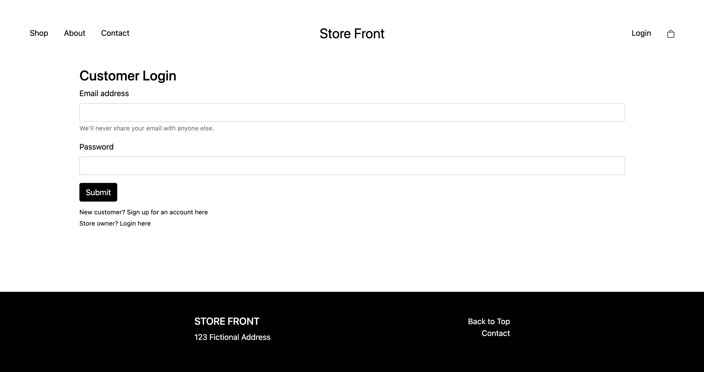
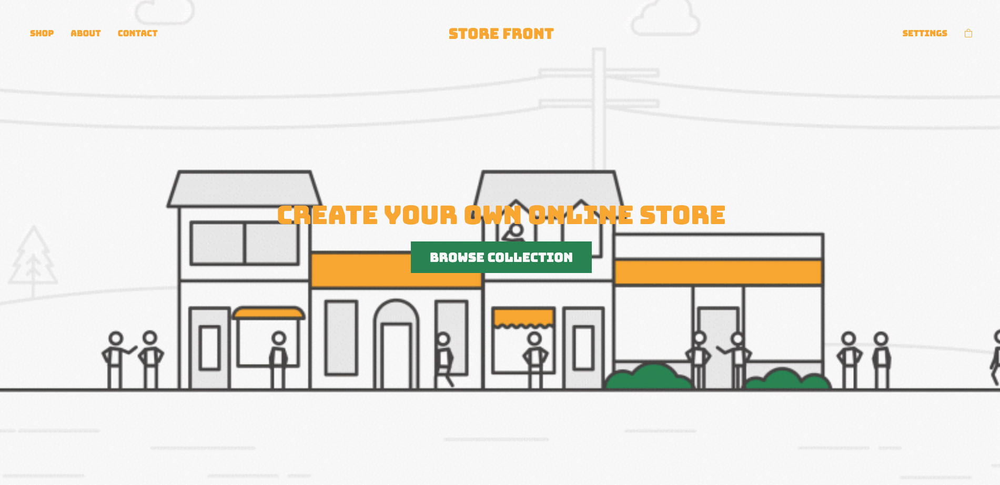
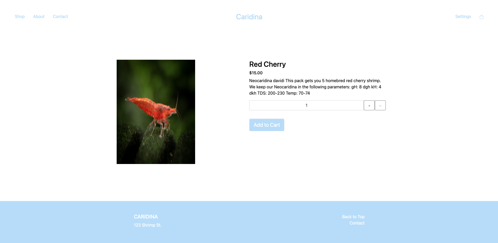
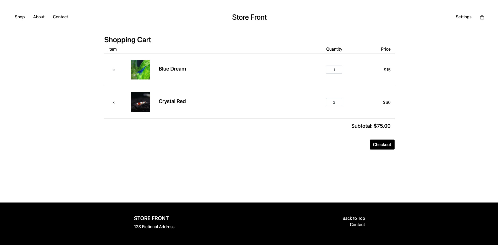
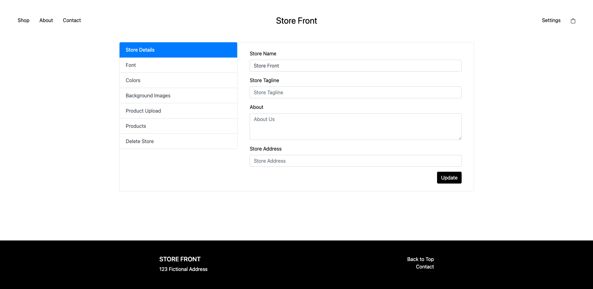

# Store-Front

## Description

This is a CMS to allow customers and store owners to operate under one roof. Customers can browse any store they choose, add/delete items to their cart, and in the future will be able to checkout. Store owners can create a storefront page with custom styling, including font, font colors, accent color, and images, as well as create any number of products.

## Table of Contents

* [Link](#link)
* [Usage](#usage)
* [Credits](#credits)
* [Questions](#questions)
* [License](#license)

## Link

Heroku deployed application:
https://pacific-sierra-18735.herokuapp.com/

## Usage

When you get to the page, there will be a login form where you will enter your email and password, or choose owner login if you are a store owner. If you don't have an account, you can click the new customer link, or create a store of your own. Once you login, you will be directed to the landing page, which displays all current stores in the database.

When you click on a store, you will be brought to that store's custom made page. There will be a background picture, top three products, and an about section with another custom background picture. 

If you click on a product, you will be brought to that products information page, which displays the price and description, and allows you to add the item to your cart.

When you click on the cart, you will be brought to the cart page, which displays all items in the user's cart, the quantity of each item, the total price of all items. You are also given the ability to delete items from your cart.

When you login as a store owner, the site redirects you to the store editor page. On this page, the user can customize your store in numerous ways including: store details, font, colors, background images, and manage your own database of products. Each respective tab has an update button which will update the user's store in real time. To view the changes, the user can simply click on the store title up top.

## Credits

First I must credit the UCLA Extension Full-Stack Web Development Coding Bootcamp, instructor Bryan Swarthout, and TA Wilson Lam for providing me with all of the tools and knowledge I used to build this application.

http://www.uclaextension.edu

The npm package "Express" was used to create the server.

https://expressjs.com/

Heroku was used to host the website for deployment.

https://www.heroku.com

MySQL Workbench was used to create the database.

https://www.mysql.com/products/workbench/

The npm packages 'mysql' was used to connect and interact with the database.

https://www.npmjs.com/package/mysql

The npm package 'Express Handlebars' was used to create the HTML.

https://www.npmjs.com/package/express-handlebars

The npm package "dotenv" was used to configure my connection data with Heroku.

https://www.npmjs.com/package/dotenv

Google fonts used for custom fonts.

https://fonts.google.com/

The program 'Jaws_DB' was used to send my database to Heroku.

https://www.jawsdb.com/

Sequelize was used for manipulating data in the database.

https://www.sequelize.org/

The Cloudinary API was used for image uploading and hosting.

https://www.cloudinary.com/

The NPM package 'Multer' was used as middleware for the image uploads.

https://www.npmjs.com/package/multer

Express-handlebars was used for templating.

https://www.handlebarsjs.com/

The password NPM package was used for creating the user login functionality.

https://www.npmjs.com/package/passport

bcryptjs was used for password encryption.

https://www.npmjs.com/package/bcryptjs

## Questions

Github profiles:

DJ Hersh: https://github.com/DJ620

Nathaniel Yu: https://github.com/nartexyu

Elie Dagher: https://github.com/Elidag-Official

Kyle Gibson: https://github.com/kyle-gibson

## License

MIT License

Copyright (c) [2020] [DJ Hersh]

Permission is hereby granted, free of charge, to any person obtaining a copy
of this software and associated documentation files (the "Software"), to deal
in the Software without restriction, including without limitation the rights
to use, copy, modify, merge, publish, distribute, sublicense, and/or sell
copies of the Software, and to permit persons to whom the Software is
furnished to do so, subject to the following conditions:

The above copyright notice and this permission notice shall be included in all
copies or substantial portions of the Software.

THE SOFTWARE IS PROVIDED "AS IS", WITHOUT WARRANTY OF ANY KIND, EXPRESS OR
IMPLIED, INCLUDING BUT NOT LIMITED TO THE WARRANTIES OF MERCHANTABILITY,
FITNESS FOR A PARTICULAR PURPOSE AND NONINFRINGEMENT. IN NO EVENT SHALL THE
AUTHORS OR COPYRIGHT HOLDERS BE LIABLE FOR ANY CLAIM, DAMAGES OR OTHER
LIABILITY, WHETHER IN AN ACTION OF CONTRACT, TORT OR OTHERWISE, ARISING FROM,
OUT OF OR IN CONNECTION WITH THE SOFTWARE OR THE USE OR OTHER DEALINGS IN THE
SOFTWARE.